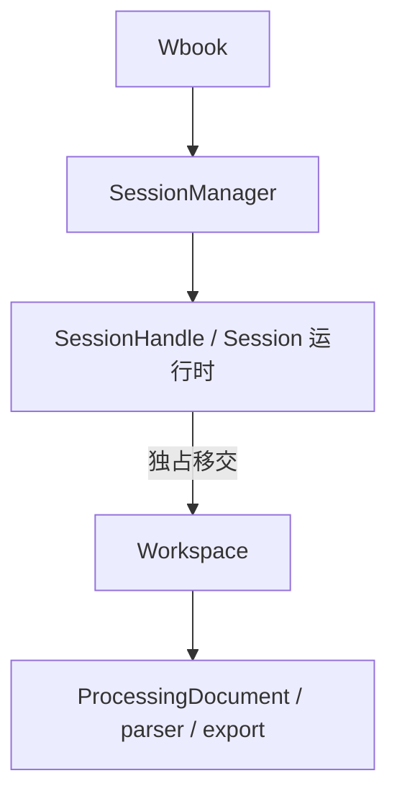

# Session 管线：设计总览

- 日期：2026-10-04
- 状态：已实施；证据与限制见 [verification.md](verification.md)
- 需求：[requirements.md](requirements.md)
- 分层设计：[Workspace 层](design-workspace.md)、[Session 运行时层](design-session.md)
- 实施与验证：[tasks.md](tasks.md)

## 1. 分层

依赖单向向下，每层只认识下一层的公开接口：

| 层              | 负责                                                                                                                         | 不负责                                     |
| --------------- | ---------------------------------------------------------------------------------------------------------------------------- | ------------------------------------------ |
| Workspace       | 一份电子书工作区的全部领域状态与规则：提取、过滤进度、解析与安装、编辑、overrides、预览缓存、导出、Revision 与失效。同步 API | 线程、准入、取消投递、快照广播             |
| Session 运行时  | 承载一个 Workspace：单操作准入、OperationId、取消投递、阻塞线程执行、完成凭据、快照、panic 隔离、关闭                        | 任何领域判断（版本、过期、过滤进度、预览） |
| Manager / Wbook | 注册、查找、创建与 shutdown 的准入边界                                                                                       | Session 内部状态                           |

归属判定：一条规则若不涉及并发也能表述，就属于 Workspace。运行时对 Workspace 只做一件事——在独占所有权下执行一个闭包。因此新增一个领域操作只需在 Workspace 加方法、在 Handle 加一行转发，不改运行时状态机。

沿用现有 ProcessingDocument、EditBatch、TocParserConfig、render_book 与 export_epub，不复制解析或 EPUB 算法。本期不引入 actor 框架、插件系统或持久任务队列。

## 2. 标识与版本

| 标识             | 所属层    | 作用                                             | 持久化                     |
| ---------------- | --------- | ------------------------------------------------ | -------------------------- |
| WorkspaceId      | Workspace | 工作区的持久身份（UUID v4）                      | 是                         |
| Revision         | Workspace | 持久状态的提交计数；写操作的乐观并发前置条件     | 是，跨保存与恢复保持单调   |
| DocumentVersion  | document  | 正文版本（document_id + revision），既有类型     | 是，恢复后必须与保存时相同 |
| SessionId        | 运行时    | 一次进程内打开的身份；Manager 生命周期内不复用   | 否                         |
| OperationId      | 运行时    | Session 内单调递增的操作身份，关联取消与完成凭据 | 否                         |
| SnapshotSequence | 运行时    | 快照更新序号，序号跳跃表示中间更新被合并         | 否                         |

写操作只携带 expected Revision。DocumentVersion 只出现在 EditBatch.base 和正文读取中，不与 Revision 同时作为前置条件：Revision 已覆盖正文变化，而 DocumentVersion 自带 document_id，足以拒绝跨文档请求。

## 3. 持久化边界

本期不实现保存与恢复，但以下约束本期必须成立，使以后增加持久化时不需要重新分层。

**持久化对象是 Workspace，不是 Session。** Session 是工作区在某个进程里的一次打开。"恢复会话"指恢复各个工作区及当时打开了哪些工作区，然后为每个工作区新建 Session；SessionId、OperationId、凭据和令牌都不跨进程。

1. **状态划分**：Workspace 分为持久状态 `WorkspaceState` 与可丢弃缓存。持久状态只含拥有所有权的数据：WorkspaceId、Revision、源路径、ProcessingOptions、可选 ProcessingDocument（正文、已安装结果、overrides）和过滤进度。预览、清理告警和一切运行时数据不属于持久状态。
2. **保存配置而非对象**：ProcessingOptions 保存 `FilterConfig` / `TocParserConfig` 这类可序列化配置，解析器在操作开始时按配置构造；Workspace 不保存 trait object。
3. **提交即变化**：持久状态只在 Workspace 的提交点改变，每次提交 Revision 加一；Revision 不变则持久状态不变。后续自动保存用 `revision != saved_revision` 判定脏状态，不需要另设脏标记。
4. **一致性来自独占**：未来的 save 是经同一运行时执行的普通只读操作，持有 Workspace 独占所有权，只会看到提交边界上的状态，不需要额外的快照锁。
5. **版本保持**：已安装结果以 DocumentVersion 判定是否 Current。恢复必须重建出相同 document_id 与 revision 的 TextDocument，否则所有已安装结果都会变为 Stale。正文的持久表示（保留 piece table 或合并为单缓冲）由持久化 spec 决定，但必须满足此条。
6. **磁盘格式与内存布局分离**：本期不为 WorkspaceState 派生 Serialize。保存格式将是独立的、带 schema 版本的 DTO，与 WorkspaceState 互相转换。快照等 serde/specta 类型只是接口 DTO，不是保存格式。
7. **恢复入口已就位**：Manager 的基本入口是 `open(Workspace)`，`create` 等于 `Workspace::new` 加 `open`。恢复只需新增 `Workspace::restore`，然后走同一入口；同一 WorkspaceId 重复打开的拒绝规则随恢复一起实现。
8. **关闭前保存的位置已就位**：关闭任务在生命周期末尾按值取得 Workspace 后才调用 `Workspace::close`，以后的"关闭前保存"插入在这两步之间，不影响其他路径。
9. **不提供占位接口**：本期没有 save/load、数据目录结构或数据库；`Params.data_dir` 保留为以后的存储位置，rocksdb 依赖的存在不代表已支持保存。

## 4. 决策记录

相对上一版草案的删除与延后：

| 上一版设计                                                                | 本版                                          | 理由                                                                                 |
| ------------------------------------------------------------------------- | --------------------------------------------- | ------------------------------------------------------------------------------------ |
| controller 异步循环、Command 枚举、数据与控制两条通道                     | 互斥锁保护的槽位加通用 `run`                  | 忙碌即拒绝、不排队，不需要 actor；控制操作只短暂持锁，天然不会被数据命令阻塞         |
| CandidateId、候选存储、候选归属与失效                                     | parse 返回 ParsedResults，install 显式安装    | 既有 `ProcessingDocument::install` 已校验 DocumentVersion（含 document_id）与范围    |
| accept_candidate 与 replace_toc 两个命令                                  | 合并为 install                                | 都是"在 expected Revision 上安装一份结果"                                            |
| 接管后禁止 initialize、accept_partial_processing、PreprocessingIncomplete | initialize 在首次安装前可按已提交进度续跑     | 过滤进度是持久状态，续跑不会重复执行已完成的过滤器；是否使用部分处理文本由调用方选择 |
| Faulted 生命周期状态                                                      | 槽位 Lost                                     | 故障是"工作区已丢失"，与生命周期正交，不再需要"Closing 中发生故障"的特例             |
| DocumentStatus 作为存储字段                                               | 由 Workspace 推导                             | 避免两份事实                                                                         |
| PreviewId、资源清单、分块读取资源、导出复用预览、残留清理重试             | 单个预览缓存；导出独立渲染；清理失败只报告    | 资源访问属于本期不做的传输层；复用是性能优化；重试针对无法稳定复现的失败             |
| 全局并发配额与 WaitingForCapacity                                         | 延后                                          | 扩展点保留在 `run` 内，不影响其他接口                                                |
| DashMap 注册表                                                            | `Mutex<HashMap>`                              | 创建与 shutdown 需要同一个同步边界                                                   |
| SessionId 耗尽报错                                                        | 删除                                          | u64 不会耗尽                                                                         |
| 导出 Packaging / Validating / Publishing 阶段通知                         | 只报告 Exporting；失败时 ExportError 自带阶段 | 细分需要改 export 接口，列入进度 TODO                                                |
| 修改 SimpleExtractor 补齐解码后取消检查                                   | Workspace 在接管前检查                        | 效果相同，提取器不改                                                                 |

## 5. 文件边界

- `workspace/`（新模块）：Workspace、WorkspaceState、ProcessingOptions、FilterConfig、WorkspaceError、WorkspaceStatus、OpContext、Phase。
- `session/mod.rs`：SessionHandle、SessionSnapshot、OperationResult、Receipt、Rejected、CloseReport；直接替换占位的 SessionState、Timeline 与 Completed 模型，不保留兼容空壳。
- `session/worker.rs`：`run` 与完成收口、进度回报、关闭任务。
- `app/session_manager.rs`：Registry 与 open / create / get / list / close / shutdown；移除 dashmap 依赖。
- `app/mod.rs`：Wbook 持有 Params 与 SessionManager。
- `export/mod.rs`：ExportOptions、RenderOptions 增加 PartialEq，供预览缓存比较；其余接口不变。
- `document/*`、`parser/*`、`extractor/*`：不改接口。
- Session 集成测试及一个只经 Wbook / Handle 的核心示例。

DESIGN_NOTE.md 的 Lifecycle 段在实施完成后更新为事实。
