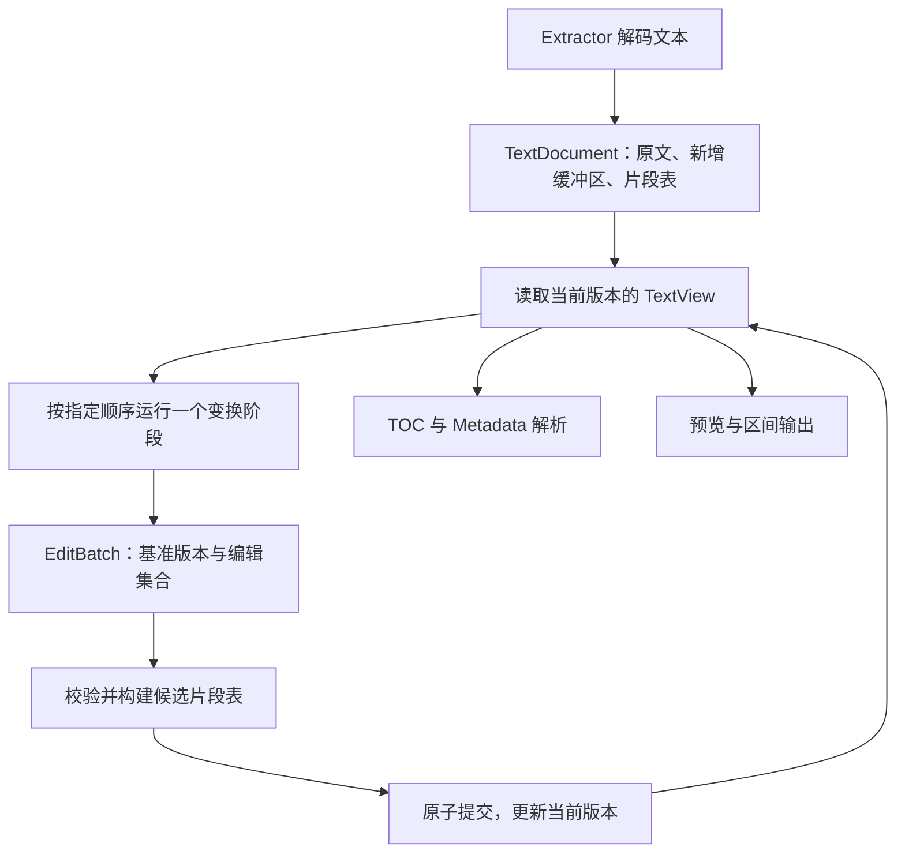

# 文本变换流水线：设计

- 日期：2026-10-04
- 状态：核心功能已实施；工作区验收存在既有阻塞，见 [performance.md](performance.md)
- 用户需求：[requirements.md](requirements.md)
- 实施与验证：[tasks.md](tasks.md)

## 1. 决策与现有设计的关系

采用“当前文档 + 版本化编辑批次”的执行模型，用简单 piece table 保存当前正文。每个变换阶段读取当前文本，提交编辑后立即更新逻辑视图；需要连续字符串时才按请求范围物化。

保留不可变的解码原文、UTF-8 字节偏移和延迟拼接全文。调整 [DESIGN_NOTE.md](../../DESIGN_NOTE.md) 中“所有操作引用原文，直到拆分或导出才生效”的约定。该约定已随实现同步更新；下文保留设计决策、范围与验证要求。

现有行为与迁移点：

| 当前入口                            | 现状                                                                                  | 目标                                                    |
| ----------------------------------- | ------------------------------------------------------------------------------------- | ------------------------------------------------------- |
| `types/text_op.rs`                  | 增删改枚举，范围指向解码原文                                                          | 统一的 `TextEdit` 与 `EditBatch`                        |
| `parser/mod.rs`                     | `FilterParser` 返回 `Vec<TextOp>`；保留未使用的 `TransformOperation` / `ContentRange` | 解析当前文档视图，统一提交批次                          |
| `parser/filter/mod.rs`              | 读取原始 `String`，输出广告行删除范围                                                 | 读取逻辑行，输出当前版本上的删除                        |
| `parser/toc/*`、`parser/metadata/*` | 直接读取 `ParsedContent` 内的字符串                                                   | 读取同一个当前文本视图                                  |
| `toc/mod.rs`、`toc/entry.rs`        | `patch: Option<String>`；目录范围用途并不统一                                         | 正文编辑移到文档层，目录继续管理结构与定位              |
| `session/worker.rs`                 | 工作流尚未实现                                                                        | 提供可独立测试的顺序处理入口，不扩展整个 Session 状态机 |

这是一项核心 API 迁移。实施前没有完整的编辑、预览、拆分和导出消费链；本次提供核心编辑、范围预览和 writer 输出能力，完整 GUI 与 EPUB 拆分仍在范围外。上表的“现状”指迁移前基线。

## 2. 执行模型



“当前版本”是同一文档的当前状态标识，不要求保存历史全文或持久化快照。默认同一文档串行修改；解析期间借用只读视图，借用结束后才能提交编辑。跨线程或外部返回的结果在安装时仍须校验所属文档和版本。

一个阶段内，规则扫描固定视图，产生针对该视图的一批编辑。只有批次完整提交后，下一阶段才能开始。后续规则要匹配本阶段新增内容时，必须成为下一阶段，不能在遍历同一个视图时混合修改坐标。

Filter 不按 `accept` 置信度自动选出唯一胜者；调用方明确提供要执行的有序过滤器列表。TOC 保留现有配置选择和可选 `CombinedParser` 行为，候选判断与解析使用同一视图。

## 3. 编辑和版本契约

以下类型表示职责与必要字段，具体模块命名可在实现时依项目风格调整。

```rust
struct DocumentVersion {
    document_id: DocumentId,
    revision: u64,
}

struct TextEdit {
    range: TextRange,
    insert: String,
}

struct EditBatch {
    base: DocumentVersion,
    edits: Vec<TextEdit>,
}
```

`DocumentId` 是文档生命周期内稳定的、不复用的身份，不是文件路径。同一路径可以产生不同文档实例；只比较 `revision` 或文本长度不能防止跨文档误用。身份和版本无需持久化，也不表示支持协同编辑。

`range` 为基准版本的逻辑文本 UTF-8 字节半开区间。空区间表示插入；非空区间加空 `insert` 表示删除；其余表示替换。空区间加空字符串是空操作。初版不扫描正文以消除“替换为相同内容”的操作，此类有效批次仍提交一个新版本。

批次入口必须验证公开构造或反序列化的数据，不依赖 `TextRange::new` 已经被调用。检查顺序如下：

1. 检查取消及文档身份、基准版本。
2. 检查每项 `start <= end <= current_length`、UTF-8 边界及长度运算是否可表示。
3. 移除合法空操作，再稳定排序编辑，同时保留原始索引用于错误定位。
4. 按下表检查歧义和冲突。不在这里推测哪个规则优先。
5. 构建完整候选结果和位置映射；最后检查取消，再一次性提交。

| 同批操作关系                           | 初版行为                           |
| -------------------------------------- | ---------------------------------- |
| 不相交的非空区间                       | 允许                               |
| 相邻非空区间，如 `[1, 3)`、`[3, 5)`    | 允许                               |
| 部分重叠、包含或相同的非空区间         | 拒绝，包括重复删除和相同替换       |
| 同一点两次非空插入                     | 拒绝；调用方明确拼成一次插入       |
| 插入点位于非空编辑内部                 | 拒绝                               |
| 插入点恰好位于非空编辑起点或终点       | 拒绝；调用方合并编辑或分为连续批次 |
| 无其他冲突的文件开头、末尾或空文档插入 | 允许                               |

该策略刻意比 Clang 可接受的部分可交换重叠更严格，以便初版保持简单和确定。排序仅用于执行一个批次，不改变阶段顺序。

空批次经身份、版本和取消检查后返回原版本与恒等映射。其他成功批次令 `revision` 增加一次。提交返回新版本和本次位置映射；失败不发布任何文档状态。错误至少区分错误文档、过期版本、反向/越界范围、非法 UTF-8 边界、编辑冲突、不可表示的长度和取消，并携带相关编辑索引。

版本递增及长度计算应使用检查运算。原子提交保证针对可返回的业务错误和取消，不扩展为进程崩溃或内存耗尽恢复协议。

## 4. 文本存储

初版 `TextDocument` 持有：

- 一份从 `ParsedContent` 移入的原始解码 `String`，之后只读。
- 新增缓冲区集合。每个缓冲区接管编辑携带的 `String`，发布后只读。
- 按逻辑文本顺序排列的 `Vec<Piece>`；每个片段保存缓冲区身份和该缓冲区的字节区间。
- 当前逻辑长度、文档版本，以及源编码和路径等解析上下文。

不为使用 `Arc` 而重新复制原文，不让 `ParsedContent` 和 `TextDocument` 各保留一份原文。借用视图不复制正文，也不让每个阶段保存一个完整文档副本。

例如原文为 `abcdef`，将 `[1, 3)` 替换为 `XY` 后，片段表为：

```text
Original[0, 1) + Added(0)[0, 2) + Original[3, 6)
```

当前逻辑文本为 `aXYdef`。再次替换逻辑区间 `[2, 3)` 时，定位到新增缓冲区中的 `Y`；新增内容和原文在编辑入口具有相同语义。

片段内部使用缓冲区局部范围，与公共逻辑 `TextRange` 分开命名或使用不同类型。原始解码文本范围也不等于输入文件的原始编码字节范围。首版不提供完整来源追踪 API；新增文字不伪造原文位置。

存储不变量：

1. 每个片段引用有效缓冲区，范围非空且位于 UTF-8 边界。
2. 片段长度之和等于当前逻辑长度，空文档可拥有空片段表。
3. 同一缓冲区中连续且逻辑上相邻的片段应合并；不跨缓冲区复制内容来合并片段。
4. 删除仅移除当前片段引用，不修改原文；不要求立即回收所有不再被引用的新增缓冲区。
5. 所有读操作按片段逻辑顺序解释内容，不能按源缓冲区偏移排序。

批次应用使用一次有序扫描构建新片段表，保留未改片段、裁剪相交边界并接入新增片段。校验和构建期间新增字符串及候选片段由临时结果持有，失败或取消直接丢弃；提交时转移所有权并替换片段表，不能提前向正式新增缓冲区发布部分内容。

设当前片段数为 P，本批编辑数为 E，新增字节数为 I。目标是排序 O(E log E)，定位和重建按有序扫描接近 O(P + E)，输入字符串构造成本计入 I；不允许每项编辑都重新扫描或复制整篇正文。随机定位初版可以是 O(P)，平衡树和行索引优化由基准数据决定。

## 5. 当前文本读取接口

提供具体的借用 `TextView`，至少支持版本、逻辑长度、按范围遍历 UTF-8 片段、按逻辑行遍历、按 Unicode scalar value 遍历和读取有限前缀。公开的范围读取携带或绑定文档版本，不能把旧范围无条件套到当前文档。

范围跨多个片段时，分块读取直接返回对应切片。明确要求连续字符串的调用使用 `Cow<str>` 或局部缓冲区：完全位于单个片段时借用，跨片段时仅拼接请求范围。实现不必引入可插拔存储 trait 或通用文档框架。

逻辑行读取必须在片段边界继续寻找换行：

- 对解析器提供不含 LF 和对应 CR 的正文切片，以及当前逻辑起点。
- 同时保留原始行范围，包括实际行终止符，供广告过滤删除整行。
- CR 和 LF 位于不同片段时仍识别为一个 CRLF。
- 不生成并不存在的末尾空行；行为与现有 `split_inclusive('\n')` 约定对应。
- UTF-8 字符边界在片段构造时已保证，字符计数不能误将多字节字符拆开。

现有正则仍按逻辑行或明确的有限前缀运行。不能逐片段独立匹配，因为 `第`、`一`、`章` 可能属于不同片段。单行跨片段时允许拼接该行；元数据最多读取当前文本前 1000 个 Unicode scalar value。等分需要对当前文本的字符迭代器计数与定位，不物化全文。

任意跨全文正则不属于初版范围，不提供一个隐式 `to_string()` 回退。未来如支持，需要单独决定物化预算或跨块匹配算法。无换行的超长文本可能使“单行局部物化”达到全文规模，应在性能报告中单列该边界。

## 6. 解析器与流水线接入

保留 `TocParser`、`FilterParser`、`MetadataParser` 分类及配置规则，不在此重构选择算法。其读取参数转为当前文档视图及必要的源路径上下文。Filter 产生当前视图上的编辑集合，由顺序执行入口包装或验证为该版本的 `EditBatch` 后统一应用。

提供一个最小的同步核心顺序执行入口：接收当前文档、取消令牌和有序过滤器；逐个执行并提交，在全部预处理成功后使用选定的 TOC 与元数据解析器。它不负责线程池、消息总线或 Session 生命周期。用户正文修订通过相同的批次应用入口提交。

各类 `accept` 与 `parse` 必须使用同一视图。`CombinedParser` 的失败回退、取消传播，以及现有规则的标题捕获、VBook 分组、等分和文件名回退语义保持不变。

自动解析结果在文档处理上下文中带有 `DocumentVersion`；不要求给每一个目录节点重复保存版本。只要结果可能脱离该上下文传递，必须携带版本封装，接收方校验后才能安装。

## 7. 定位点、目录有效性与正文区间

批次提交产生从旧版本到新版本的 `ChangeMap`。它保存有序的旧区间与对应新区间，不保存已删除正文，不构成撤销历史。初版只实现单批映射；连续映射可依次使用各批结果，不实现编辑批次的通用 `compose` 或并发 `map` 算法。

定位点使用如下确定语义：

| 定位点与编辑的关系           | 映射结果                                            |
| ---------------------------- | --------------------------------------------------- |
| 严格位于编辑区间之外         | 按此前编辑累计长度差迁移                            |
| 恰好位于插入点               | `Before` 留在新增内容之前；`After` 移到新增内容之后 |
| 位于非空替换区间起点 / 终点  | 分别映射到替换后区间起点 / 终点                     |
| 严格位于被删除或替换区间内部 | 返回失效，不猜测新文本中的对应字符                  |

定位点在基准视图上创建时校验 UTF-8 边界，并携带所属版本；映射只接受这种已验证的定位点，再检查版本和位置范围。`ChangeMap` 不为重新验证旧文本边界而保留旧全文或旧片段表。区间两个端点都可映射，不代表区间内容未改变；消费方仍需知道变更是否触及区间。新增标题可能出现在旧标题范围之外，因此仅检查原有标题交集无法保证目录语义有效。

首版采用保守策略：任意非空操作批次成功提交后，已有 TOC 和自动元数据结果均过期。位置映射用于迁移定位信息或向调用方解释变化，不将过期结果自动认证为有效。

过期目录可保留用于展示或人工调整，但不能作为当前有效的拆分依据。重新解析生成新候选结果；调用方显式安装当前版本的结果。已有用户调整的树不被自动覆盖，不按标题字符串猜测节点对应关系。本期不实现增量标题识别和新旧树自动合并。调用方明确设置的元数据也不能被自动提取结果直接覆盖。

现有 [TOC_PARSING.md](../../TOC_PARSING.md) 已区分标题 span、长度切分 chunk 和容器聚合范围。本迁移保持这一差别，只将它们的坐标域改为解析时的当前文档。正文输出接收调用方显式确定的当前版本正文区间，不在此发明通用章节边界算法，也不因调整目录展示顺序而改变源文本片段顺序。

## 8. 预览与输出

预览区间读取和 `write_range` 一类输出能力共享同一片段遍历逻辑。输出传入版本、有效文本范围和 writer，依次写出切片；不再在章节层额外应用补丁。

预览可以物化调用方请求的有限区间。输出按片段写入，在长片段内按有界块检查取消；块边界保持 UTF-8 有效。一个阻塞的 writer 调用无法被取消令牌强制打断，取消在它返回后检查。

输出操作期间读取同一固定视图。调用方的章节计划若依赖目录，必须校验计划与目录均属于当前版本；单纯范围合法不能证明旧拆分计划有效。端到端测试使用显式构造的正文区间，以免把尚未实现的 EPUB 拆分器作为本 spec 的前置条件。

I/O 错误或取消可能留下部分 writer 输出。此接口不承诺外部文件原子性，也不修改文档；最终文件临时写入和发布由完整导出功能负责。

## 9. 内存、取消与资源边界

常驻文本内存约为原文 N + 累计保留新增文本 A + 片段元数据 O(P)，另有编辑集合、候选片段表和局部读取缓冲区。A 不等于最终文档相对原文的净增长，已删除的新增缓冲区也可能继续占用内存。

密集替换可能使 A 接近甚至多轮累计超过 N。初版只保证不按每个阶段保存完整版本，不保证所有编辑都稀疏，不默认增加垃圾回收或压缩策略；如实记录内存曲线，再判断是否需要回收未引用的新增缓冲区。

长遍历在循环中检查取消；长单片段的扫描和输出也需要检查点，不能仅在跨片段时检查。单次第三方正则调用不能被取消令牌强制中断，该限制应保留在接口和性能说明中。

最后一次取消检查是本批次的取消决策点：此时已观察到取消就保留旧状态；检查通过后到达的取消允许本批次完整提交，随后阻止下一阶段。不能承诺取消信号与状态发布之间不存在竞态，也不能在完整提交后返回暗示本批次未生效的结果。跨多个阶段的全局回滚、日记和事务恢复不属于该保证。

## 10. 迁移策略与代码边界

建议新增 `document` 模块承载文档存储、视图、批次应用和位置映射。只按实际代码规模拆分子模块，不预先增加通用存储后端或插件抽象。

先建立新模型及验证，再一次性迁移受影响解析器调用链和测试，最后移除旧正文编辑入口。每个实现提交应可编译；不可分割的 trait 迁移允许与所有调用方放在同一个提交中。

最终收敛如下：

- `TextOp` 生产和消费迁移到 `TextEdit` / `EditBatch`。
- 删除已被新模型取代且无使用点的 `TransformOperation`、`ContentRange`；`ByteRange` 仅在确认无其他用途时作为该旧坐标模型的遗留清理。
- `TocNode` 和 `TocEntry` 移除可执行正文字符串 `patch`，正文修改归文档所有。`TocNode` 不再直接反序列化，读取目录结构统一经过检查旧 patch 的 `TocEntry` / `TocSnapshot` 路径。
- 旧快照中缺失或为 `null` 的 `patch` 可读取；任何字符串值（包括 `""`）均明确返回不支持旧补丁格式的错误，其他非 `null` JSON 值也拒绝。
- 反序列化兼容入口应明确识别旧 `patch`，不得仅删除字段后依赖 Serde 忽略未知字段。新序列化不再写出该字段。
- 裸 `TocSnapshot` 保留为结构传输格式；没有文档版本的旧快照不能直接充当当前有效的解析或导出计划。
- 更新受影响的公开类型、serde / specta 声明、测试和原有两份设计文档。没有已证实的历史项目数据时，不新增通用迁移框架。

保持 TOC 节点 ID、树操作、解析配置以及 Extractor 编码探测策略不变。删除旧正文编辑类型属于本迁移；其他预先存在的无关代码不在清理范围内。

## 11. 验证与验收

正确性以简单连续 `String` 实现作为独立参考：针对同一版本的合法批次按逆位置顺序应用，然后与文档视图比较。参考实现只用于测试和基准，不进入生产处理路径。

验证包括：固定回归场景、多轮 UTF-8 随机编辑对照、跨片段行与正则、位置映射边界、目录版本失效、区间输出一致性，以及失败/取消的批次原子性。所有原有解析器业务测试应在没有编辑的视图上保持通过。

性能实验采用 10 MiB、100 MiB、300 MiB 的合成混合中文/ASCII 文本；覆盖稀疏整行删除、密集替换和连续十轮编辑，并单列超长单行。生产实现与每轮构造当前 `String` 的基线使用同一输入和编辑语义。性能运行与参考正确性运行分开，避免参考实现的额外全文副本污染峰值内存。

记录硬件、构建模式、输入与换行分布、批次大小、原文字节数、新增缓冲区累计字节数、片段数、耗时和峰值内存。初版不设未经测量的绝对毫秒阈值；“阶段不复制全文”和“当前结果正确”是硬性验收条件。测量不足以证明更快时必须明确说明。

需求与任务的逐项对应见 [tasks.md](tasks.md)。

## 12. 参考依据与取舍

| 官方资料                                                                                                            | 本设计借鉴                                           | 不照搬的部分                             |
| ------------------------------------------------------------------------------------------------------------------- | ---------------------------------------------------- | ---------------------------------------- |
| [Clang Replacements](https://clang.llvm.org/doxygen/classclang_1_1tooling_1_1Replacements.html)                     | 编辑集合的冲突检查，以及连续变更引用前一轮结果的区分 | 自动接纳部分可交换重叠                   |
| [CodeMirror ChangeSet](https://codemirror.net/docs/ref/#state.ChangeSet)                                            | 明确变更基准、应用后版本和位置映射                   | 完整 compose、并发 map、撤销及其坐标单位 |
| [VS Code Text Buffer Reimplementation](https://code.visualstudio.com/blogs/2018/03/23/text-buffer-reimplementation) | 原文与新增缓冲区分离，通过片段表示当前文本           | 直接移植红黑树与完整编辑器优化           |
| [calibre conversion pipeline](https://manual.calibre-ebook.com/conversion.html#introduction)                        | 处理阶段依次消费当前中间结果                         | 将整本 TXT 提前物化为 XHTML 文档树       |

资料在 2026-10-04 的前置分析中核对。本 spec 将这些机制按 WBook 的已确认需求组合；不声称任一参考系统采用这里完全相同的模型。

## 13. 实现落点

- `src/document/mod.rs`：`TextDocument`、`DocumentVersion`、`EditBatch`、批次应用与错误。文档身份使用随机 UUID 的 16 字节表示，避免进程重启后的计数器身份复用。
- `src/document/view.rs`：借用 `TextView`、逻辑行、字符遍历、版本绑定的范围读取和输出。
- `src/document/change.rs`：已校验定位点、插入关联和单批位置映射。
- `src/document/pipeline.rs`：`ProcessingDocument`、带版本的 `ParsedResults`、显式结果安装及 `OutputPlan`。
- `examples/transform_bench.rs` 与本目录的 `benchmark.py`：独立进程测量与字符串基线。

`run` 和 `parse` 只返回解析候选结果，调用方显式 `install` 后才替换已有目录。`metadata_overrides` 保存调用方设置的元数据；自动解析不覆盖它。现有应用入口尚未有完整 Session 工作流，本次没有虚构或扩建这些入口。
